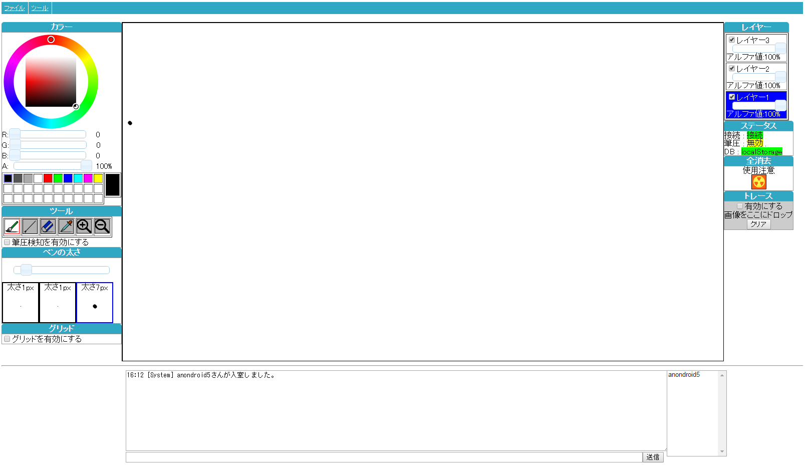

# CanvasChat

WebSocket

# Requirements
* Java >= 1.8
* Tomcat >= 7.0
* maven2 (compile)

http://mvnrepository.com/

#Details
###Login Interface

###Chat Interface

###Functions

 - Tool Force
 - ColorPicker
 - ZoomOut
 - ZoomIn
 - Layer
 - Chat
 - Grid
 - Draw
 - Erase
 - Trace

#Author
Fumihiko Akagi

#Copyright
    Copyright (c) 2013 Fumihiko Akagi
